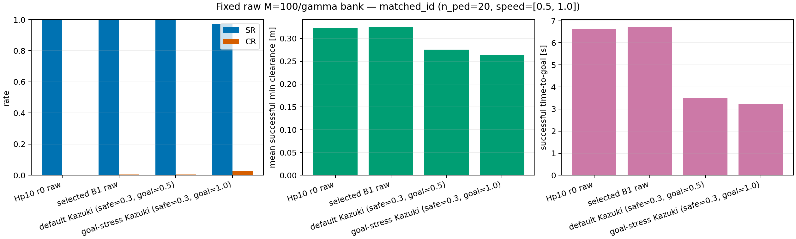
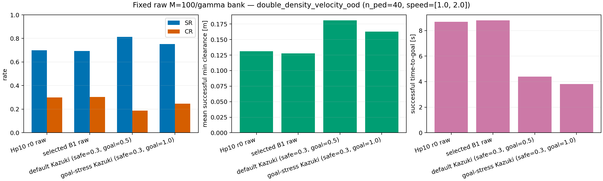
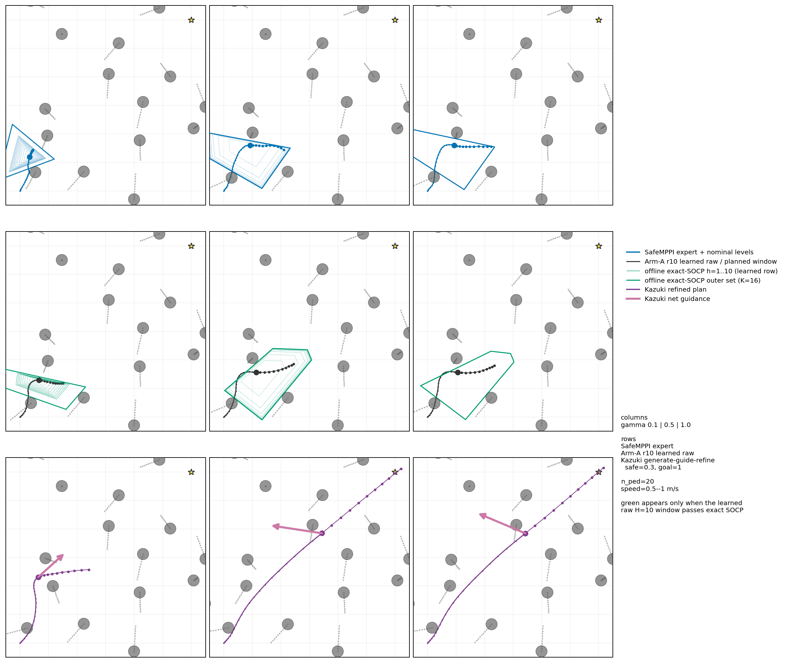
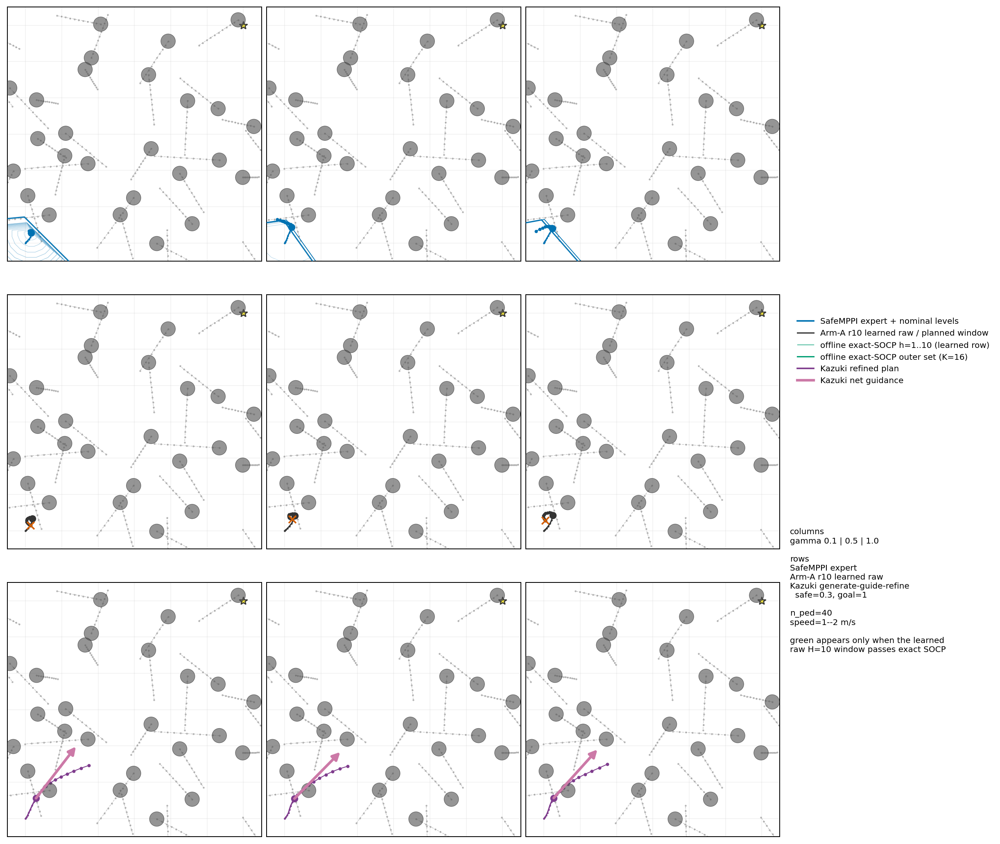

# Safe Flow Expansion for moving-crowd SFM navigation

This repository is the standalone research handoff for the moving-pedestrian
SFM extension of **B1 Safe Flow Expansion**. It preserves the exact source
snapshot, transitive policy/SafeMPPI/verifier dependencies, promoted Hp10
checkpoint, prior selected checkpoint, fixed-bank evidence, mechanism videos,
and runtime-gate provenance used by the current study.

> **Status (2026-07-21).** The current nine-arm
> \(\alpha\times\) replay-epoch sweep is running on Helios under source commit
> `e5ab47ba4971aae6c1df710c6d6864577f3728f7`. Claude is operating the run;
> this repository does not claim unfinished results. All live outputs belong
> under `/data3/research1`. The latest completed result bundled here is the
> fixed M100-per-\(\gamma\) pre-expansion ID/OOD deployment described below.

## TL;DR

- The static-obstacle sister repository is
  [`DHLeexpress/safe_flow_expansion`](https://github.com/DHLeexpress/safe_flow_expansion).
  The two repositories share the B1 mechanism but **do not share Git ancestry**.
- The static workbook was first published on 2026-07-19 at `8ae3d99`; the SFM
  implementation first appeared inside `safeMPPI` on 2026-07-20 00:48 PDT at
  `e6fcebe`. They developed in parallel after that conceptual fork.
- SFM replaces the static low7/32×32 representation with ten recent nominal
  \(H_P\) grids, a GRU over the last 16 robot controls, and a moving-pedestrian
  full-\(H=10\) certificate. The visual encoder is frozen during expansion.
- Per alive context, the policy samples \(K=16\) windows, RBF uncertainty
  chooses \(B=4\) verifier queries, all resolved queries enter \(\mathcal D\),
  and only full-horizon positives enter \(\mathcal D^+\). The executed first
  action is the admissible positive with maximum one-step nominal \(H_P\)
  margin. No admissible query means fail-closed NVP for that replica only.
- The current GP memory uses a two-round window, at most 256 retained
  upper-quartile positives per round, rotating equal \(\gamma\) quotas, and a
  cap of 512. \(\beta_n\) is recalibrated each round to normalized ESS 0.5.
- The completed severe OOD benchmark doubles both pedestrian count and speed:
  training/ID is 20 pedestrians at 0.5–1.0 m/s; OOD is 40 at 1.0–2.0 m/s.
  The prior selected A-r10 checkpoint did **not** improve r0 there
  (CR 30.3% versus 30.0%). This is the negative baseline the running sweep must
  beat.
- Raw evaluation always means the canonical generative policy: temperature 1,
  NFE 8, one sampled window per context, execute its first action, with no GP,
  verifier, selector, guidance, MPPI refinement, or fallback.

## Repository lineage: same mechanism, different task

There is no commit at which this repository was forked from the static sister
repository. `safe_flow_expansion_SFM` was created on GitHub as an empty remote
on 2026-07-21, while the SFM code had already evolved in the shared
`DHLeexpress/safeMPPI` worktree.

| event | timestamp (PDT) | repository / commit |
|---|---|---|
| Static standalone workbook published | 2026-07-19 20:09 | `safe_flow_expansion@8ae3d99` |
| SFM Hp10+B1 implementation begins | 2026-07-20 00:48 | `safeMPPI@e6fcebe` |
| Static B1 handoff promoted | 2026-07-20 16:39 | `safe_flow_expansion@bee3f2b` |
| Static repository focused on B1 | 2026-07-20 18:32 | `safe_flow_expansion@94cc262` |
| Latest SFM scheduler/protocol snapshot | 2026-07-21 12:51 | `safeMPPI@e5ab47b` |
| SFM standalone remote created | 2026-07-21 20:55 | empty remote; no ancestor |

Thus the honest description is: both projects inherit the same B1 research
mechanism from `safeMPPI`; the SFM task-specific line starts at `e6fcebe`, not
from a commit in the static workbook. See [REPOSITORY_LINEAGE.md](REPOSITORY_LINEAGE.md)
for the exact histories and semantic differences.

## 1. Task, scenes, and metrics

The robot starts at \((0,0)\), targets \((6,6)\), and interacts with moving
radius-0.2 m pedestrians at \(\Delta t=0.1\) s. Pedestrian motion used by the
certificate is constant velocity across each candidate horizon. Every episode
uses a fixed safety level
\(\gamma\in\{0.1,0.2,0.3,0.4,0.5,0.7,1.0\}\).

| profile | pedestrians | desired speed | role |
|---|---:|---:|---|
| `training` / `matched_id` | 20 | 0.5–1.0 m/s | demonstration distribution and matched test |
| `requested_ood` | 30 | 1.0–1.5 m/s | earlier moderate density+velocity shift |
| `double_density_velocity_ood` | 40 | 1.0–2.0 m/s | current severe OOD expansion target |
| `density_ood` | 50 | 0.5–1.0 m/s | rejected diagnostic: r0 was already nearly saturated |

The headline metrics are success rate (SR), collision rate (CR), successful
minimum clearance, successful time-to-goal, and raw planned-window safety
validity \(V_{\rm safe}\). Fixed scenario banks and all seven \(\gamma\) values
must be shared across compared checkpoints. One explanatory gallery is not an
evaluation.

## 2. Demonstrations and Hp10 pretraining

### SafeMPPI expert

The demonstration expert samples 2048 MPPI trajectories with horizon 10,
MPPI temperature 0.1, 16 nominal-polytope base faces, and the original cost
configuration including `centroid_gain=0.2`, `centroid_smooth=0.25`,
`centroid_eps=0.15`, and `smooth_weight=0.12`. Pedestrian velocity is supplied
to this expert. These values belong to demonstration generation; raw learned
policy evaluation has no MPPI temperature or expert wrapper.

The dataset contains successful SafeMPPI windows from 500 generated episodes
per \(\gamma\) before trajectory-disjoint filtering. The promoted checkpoint
records 238,222 training and 26,139 validation windows across the seven
\(\gamma\) values. Pretraining assigns equal objective mass in the hierarchy

\[
  \gamma\;\longrightarrow\;\text{successful trajectory}
  \;\longrightarrow\;\text{window},
\]

so long trajectories do not silently dominate. The original tensor dataset is
not duplicated in Git; its absolute path and SHA-256 inventory are recorded in
[DATA_POINTER.json](DATA_POINTER.json) and in the promoted checkpoint.

### Policy input and output

At closed-loop step \(t\), the condition is

\[
c_t = \bigl(H_{P,t:t-9},\; \ell_t,\;u_{t-16:t-1}\bigr),
\]

where:

- \(H_{P,t:t-9}\in\mathbb R^{10\times16\times12}\) contains the newest-to-oldest
  history of the nominal-polytope signed-field channel; missing pre-start
  frames repeat the first current frame;
- \(\ell_t=[(g-p_t)/5,\;v_t/2,\;\gamma]\in\mathbb R^5\);
- the GRU consumes the previous 16 executed robot controls. It does **not**
  consume pedestrian identity or velocity directly.

The model is a conditional flow-matching velocity field over
\(U\in\mathbb R^{10\times2}\). It has a 10-channel visual encoder, a 16-d GRU,
encoded low state, a width-256 residual trunk with two blocks, and a 20-d
control-window head (331,388 parameters). The promoted r0 checkpoint was
trained from scratch; no partial transplant was used. The visual encoder is
frozen during B1 expansion, while the flow trunk/head remain trainable.

The CFM objective for a positive target window is

\[
  x_\tau=(1-\tau)x_0+\tau x_1,\qquad
  \mathcal L_+(\theta)=
  \mathbb E\left[\|v_\theta(x_\tau,\tau,c)-(x_1-x_0)\|_2^2\right].
\]

## 3. B1 Safe Flow Expansion

### 3.1 Frozen macro-round and acquisition

A macro-round contains eight independent replicas for every \(\gamma\), hence
56 scenario-\(\gamma\) lineages. A replica reaching NVP ends only that replica;
other replicas continue. The model and GP state are frozen throughout gathering
within a macro-round.

For every alive context, sample

\[
  U_t^{1:K}\overset{\rm iid}{\sim}p_{\theta_n}(\cdot\mid c_t),
  \qquad K=16.
\]

Using the frozen current-model representation \(z=\phi_s(U,c)\), the RBF
kernel and GP posterior variance are

\[
  k_\ell(z,z')=\exp\!\left(-\frac{\|z-z'\|_2^2}{2\ell^2}\right),
\]

\[
  \sigma_n^2(z)=k_\ell(z,z)-k_n(z)^\top
  (K_n+\lambda I)^{-1}k_n(z),\qquad \lambda=10^{-2}.
\]

Sequential acquisition draws \(B=4\) candidates without replacement from the
finite-pool Gibbs tilt

\[
  \pi_n(j\mid c_t)\propto
  \exp\!\left(\frac{\sigma_n(U_t^j,c_t)-\sigma_{\max}}{\beta_n}\right).
\]

The authenticated 50-embedding preflight found
\(\ell_0=0.4842165344\) and fixed \(\ell=0.2421082672\). The stable active
configuration uses cap 512 and \(\lambda=0.01\). At the start of every round,
\(\beta_n\) is solved for normalized ESS 0.5. ESS controls selection
concentration; it does not guarantee behavioral multimodality.

### 3.2 Full-window verification and execution

Every queried candidate is rolled out for all ten transitions. Goal reach does
not truncate the candidate certificate. For predicted pedestrian centers
\(p^i_h=p^i_0+h\Delta t\,v^i_0\), the verifier fits moving separating faces and
checks gamma-dependent level-set contraction over the full window. Sixteen
artificial outer-boundary faces are always included.

The verifier label is

\[
 y(U,c,\gamma)=\mathbf 1\{\text{task-space}\land
 \text{time-indexed collision-free}\land
 \text{full-}H\text{ certificate}\}.
\]

All successfully resolved queried records enter \(\mathcal D\); only records
with \(y=1\) over the complete horizon enter \(\mathcal D^+\). Solver errors
enter neither store.

Execution has a second, local admissibility gate:

\[
 \mathcal A_t=\left\{j:\;y_j=1,\;
 H_P(x^j_{t+1})\ge(1-\gamma)H_P(x_t)\right\}.
\]

The current sweep uses the original max-one-step-margin rule

\[
 j^\star\in\arg\max_{j\in\mathcal A_t}
 \left[H_P(x^j_{t+1})-(1-\gamma)H_P(x_t)\right],
 \qquad u_t=U^{j^\star}_0.
\]

Only the first action is executed, then the system replans. If
\(\mathcal A_t=\varnothing\), the replica terminates as NVP. There is no expert
fallback, recovery start, curriculum, proximal term, rollback, or hand-crafted
proposal injection.

### 3.3 GP memory and replay memory are different

The labeled shards \(\mathcal D,\mathcal D^+\) are retained for provenance.
The acquisition GP is deliberately bounded: after each round, each \(\gamma\)
keeps a rotating 36/37 quota selected from that round's upper uncertainty
quartile, for at most 256 records. Two rounds are active, so the GP cap is 512
with 73/74 records per \(\gamma\) when full. Quotas are never borrowed between
\(\gamma\) values. This prevents a long/easy gamma or early episode segment
from monopolizing acquisition memory.

CFM replay uses only the most recent \(W=2\) rounds. Every eligible record is
visited exactly \(E\) times and receives hierarchical mass

\[
  w_i=\frac{1}{|\Gamma|}
      \frac{1}{|\mathcal L_\gamma|}
      \frac{1}{|\mathcal C_{\gamma,\ell}|}
      \frac{1}{|\mathcal Q^+_{\gamma,\ell,c}|},
\]

where \(\ell=(\text{round},\text{episode})\). This normalizes gamma, lineage,
context, and positive-query multiplicity; it does not force the raw generator
to preserve behavioral modes.

For negative replay, let \(g_+=\nabla\mathcal L_+\) and
\(g_-=\nabla\mathcal L_-\) on rejected full-window queries. The signed update is

\[
  g=g_+-\rho g_-,\qquad
  \rho=\alpha\frac{\|g_+\|_2}{\|g_-\|_2+\varepsilon}.
\]

At \(\alpha=0\), the code delegates before touching \(\mathcal D^-\), making
it exactly the positive-only control. The running sweep fixes 16 optimizer
chunks, batch size 128, learning rate \(10^{-4}\), and varies
\(\alpha\in\{0,10^{-3},10^{-2}\}\) and complete replay epochs
\(E\in\{1,4,16\}\).

## 4. Honest evaluation and selection

Training/gathering trajectories are controller-induced and uncertainty tilted;
they are not raw model evaluation. The current protocol therefore separates:

1. canonical raw temperature-1 M10/\(\gamma\) monitoring at every round;
2. four shortlisted checkpoints selected from development records;
3. a disjoint M10 bank that locks one seven-\(\gamma\) temperature vector per
   shortlisted checkpoint;
4. one M50/\(\gamma\) screen for those locked candidates;
5. one untouched paired M100/\(\gamma\) confirmation for the winner, reporting
   both canonical temperature 1 and the locked vector.

Temperature tuning is therefore a separately labeled deployment calibration,
not a replacement for canonical raw evaluation and not a per-round post-hoc
hack.

Kazuki is also a separate controller: it starts from the same Hp10 pretrained
prior, adds goal/safety guidance, and performs MPPI refinement. Even zero
guidance coefficients would not make it raw flow because refinement and warm
start remain.

## 5. Latest completed fixed-bank result

The bundled result uses 100 predeclared scenarios per \(\gamma\), 700 rollouts
per method and profile. “Selected B1 raw” is the legacy arm-A round-10
checkpoint chosen by an earlier frozen M20 screen; it was not reselected using
these M100 outcomes.

| profile | method | SR | CR | successful clearance | successful time |
|---|---|---:|---:|---:|---:|
| matched ID | Hp10 r0 raw | 99.71% | 0.29% | 0.324 m | 6.63 s |
| matched ID | legacy selected A-r10 raw | 99.57% | 0.43% | 0.325 m | 6.72 s |
| matched ID | default Kazuki (safe .3, goal .5) | 99.57% | 0.43% | 0.275 m | 3.49 s |
| severe OOD | Hp10 r0 raw | 70.00% | 30.00% | 0.131 m | 8.69 s |
| severe OOD | legacy selected A-r10 raw | 69.43% | 30.29% | 0.128 m | 8.79 s |
| severe OOD | default Kazuki (safe .3, goal .5) | 81.29% | 18.71% | 0.181 m | 4.39 s |
| severe OOD | goal-stress Kazuki (safe .3, goal 1.0) | 75.29% | 24.71% | 0.163 m | 3.81 s |

The scientific conclusion is negative but useful: Hp10 pretraining solves the
matched distribution, while the old A-r10 expansion does not improve the
double density+velocity shift. The current alpha×replay sweep exists to test
whether controlled negative replay and update exposure can change that result.

### Fixed-bank figures

Matched ID:



Double density+velocity OOD:



The complete cell-level metrics, Wilson intervals, scenario-cluster bootstrap
intervals, seed banks, and checkpoint hashes are retained under
`provenance/pre_expansion/`.

## 6. Mechanism visualization

The method panels compare \(\gamma\in\{0.1,0.5,1.0\}\). Videos are linked next
to their still previews.

### Matched ID

[MP4](assets/mechanism/matched_id_method_gamma_3x3.mp4)



### Double-shift OOD

[MP4](assets/mechanism/double_shift_method_gamma_3x3.mp4)



The earlier density-only candidate-query render is intentionally not bundled:
visual QA found that its legend still exposed the superseded terminal-prefix
label even though the current runtime requires full H=10 for every query. The
current renderer source is included, but a stale figure is not presented as
evidence. Any regenerated query diagnostic must use gray for K, orange for B,
green for full-H positive, red for rejected, and thick blue for the executed
first action; every candidate must own its own fitted verifier witness.

## 7. Code map and reproduction

Start with [CODE_INDEX.md](CODE_INDEX.md). The active entry points are:

- `source_snapshot/overnight_run_07_12_sfm/sfm_b1_expand.py`: macro-round,
  acquisition, verification, execution, replay, and checkpoints;
- `sfm_b1_rbf.py`: RBF posterior, sequential acquisition, and adaptive beta;
- `sfm_metrics2.py`: full-H moving-pedestrian fitted-face certificate;
- `sfm_b1_store.py`: query shards, gamma-balanced GP retention, hierarchical
  replay, and signed gradient update;
- `sfm_b1_alpha_steps_sweep.py`: current nine-arm evaluation/selection driver;
- `run_sfm_b1_alpha_inner_sweep.sh`: authenticated Helios launcher;
- `stage3_pretrain_sfm.py`: trajectory-disjoint Hp10 pretraining;
- `sfm_b1_benchmark.py` and `sfm_b1_curve_eval.py`: fixed-bank raw evaluation.

The source layout deliberately mirrors the original `safeMPPI` root, so
`_paths.py` resolves its dependencies without rewriting scientific code.

```bash
cd source_snapshot/overnight_run_07_12_sfm
python -m pytest analysis/test_sfm_b1_*.py \
  analysis/test_sfm_hp_history.py \
  analysis/test_sfm_kazuki_cost_match.py -q
```

The expensive canonical launcher is Helios-specific and expects the external
dataset plus GPUs 1 and 3. Do not launch it from a laptop. Package integrity can
be checked without running science:

```bash
python scripts/verify_package.py
```

## 8. Known blind spots

1. A valid H=10 window is not a proof of recursive feasibility or eventual
   goal reach.
2. Pedestrian prediction is constant velocity over a candidate window.
3. The current verifier is an exact 2-D angular-interval fitted-face checker
   with 16 artificial boundary faces; it is not a generic CVXPY/conic solver.
   Its witness is directly checked, but real-time SOCP claims require separate
   solver evidence.
4. RBF distance is only as useful as the frozen Hp10/flow representation.
   ESS can be 0.5 while uncertainty is behaviorally blind; uplift and route
   support still need monitoring.
5. Bounded GP memory (W=2, cap 512) is a declared approximation to all-history
   AFE, introduced for relevance and computational control.
6. The max-one-step nominal margin is local. It ranks already full-H-certified
   queries but cannot itself guarantee a viable next replanning state.
7. The data generator source that originally serialized `dataset_id_v01` was
   not present in the authenticated `e5ab47b` source tree. The faithful expert,
   dataset hashes, split metadata, and pretraining code are included, but the
   large tensor files remain external.
8. The current sweep's runtime gate forecasts about 5 h 29 min. Its dominant
   measured stages were raw M10 sanity evaluation and verification, not GPU
   CFM updates. The gate is provenance, not a scientific outcome.

## Artifacts and provenance

- Promoted r0: `checkpoints/hp10_pretrained_r0.pt`, SHA-256
  `1b5179c935d3eeff8824967d707d64cc9bab273949ee1f0e4f190172bab1b215`.
- Legacy selected A-r10: `checkpoints/b1_legacy_selected_A_r10.pt`, SHA-256
  `bf6f521dd2dd6de4cffcce672a8ce4adbf00bb14e71dd9fd27704d205f65744c`.
- Current source lineage: `safeMPPI@e5ab47ba4971aae6c1df710c6d6864577f3728f7`.
- Runtime gate: `provenance/runtime_gate/`.
- Byte-level inventory: `SOURCE_MANIFEST.json`.
