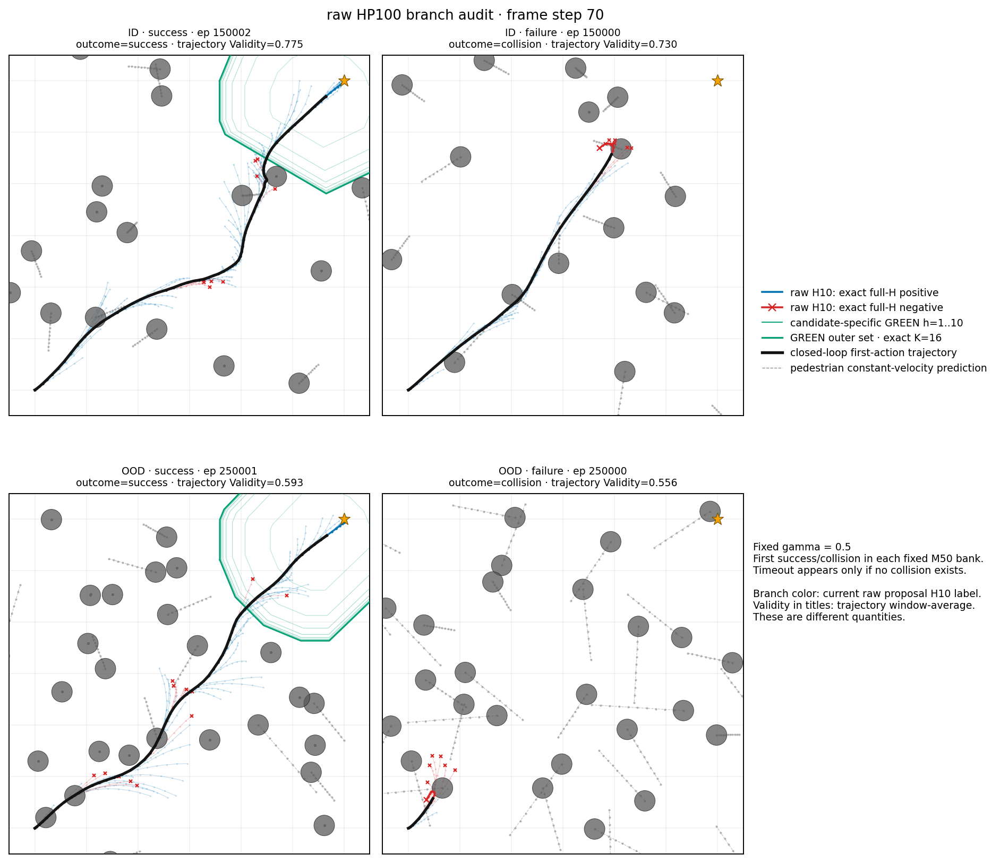

# Safe Flow Expansion for moving-crowd SFM navigation

This repository is the standalone, source-complete research package for Safe
Flow Expansion in the moving-pedestrian SFM task. The canonical pretrained
baseline is now **HP100 v3** (2026-08-02). The older Hp10/B1 experiments remain
available as an explicitly labeled historical archive.

## Start here: canonical files

| item | file | purpose |
|---|---|---|
| Claude handoff | [CLAUDE_HP100_EXPANSION_HANDOFF.md](CLAUDE_HP100_EXPANSION_HANDOFF.md) | Immutable contracts and the next HP100 expansion task |
| Canonical checkpoint | [hp100_pretrained_r0_258999ae.pt](checkpoints/hp100_pretrained_r0_258999ae.pt) | Promoted epoch-119 HP100 policy |
| Latest result | [LATEST_RESULT.md](LATEST_RESULT.md) | Current ID/OOD baseline and honest open objective |
| Dataset contract | [DATA_POINTER.json](DATA_POINTER.json) | External tensors, hashes, split, and target semantics |
| Source map | [CODE_INDEX.md](CODE_INDEX.md) | Active HP100 implementation and known blind spots |
| Pretraining report | [pretraining_report.json](provenance/hp100_pretrain_20260802/pretraining_report.json) | Full selection and runtime provenance |
| Dataset manifest | [dataset_manifest.json](provenance/hp100_pretrain_20260802/dataset_manifest.json) | 3,500-lineage authenticated collection contract |
| ID raw M50 | [id_m50.json](provenance/hp100_pretrain_20260802/id_m50.json) | Matched-ID, temperature 1, NFE 8 |
| OOD raw M50 | [ood_m50.json](provenance/hp100_pretrain_20260802/ood_m50.json) | Double-density/double-speed OOD |
| Branch video | [hp100_id_ood_branch.mp4](assets/hp100_20260802/branch_viz/hp100_id_ood_branch.mp4) | ID/OOD success and failure with exact GREEN labels |
| SafeMPPI mechanism | [hp100_safemppi_mechanism_g0p2_ep109.mp4](assets/hp100_20260802/expert_mechanism/hp100_safemppi_mechanism_g0p2_ep109.mp4) | 2,048 proposals, accept/reject set, weighted target |
| Data provenance | [hp100_expert_g0p2_ep109.mp4](assets/hp100_20260802/data_provenance/hp100_expert_g0p2_ep109.mp4) | Stored rollout and exact 10x32x100 Hp history |
| Package inventory | [SOURCE_MANIFEST.json](SOURCE_MANIFEST.json) | Byte-level tracked-file manifest |



## Current status

The checkpoint was selected using only trajectory-disjoint ID validation and
fixed raw temperature-one ID screening/finalist selection. OOD was never used for
promotion. The public fixed-bank raw M50 results are:

| distribution | pedestrians / speed | SR | CR | timeout | Validity | successful clearance | successful time |
|---|---|---:|---:|---:|---:|---:|---:|
| matched ID | 20 / 0.5-1.0 m/s | 95.71% | 4.29% | 0% | 79.06% | 0.301 m | 5.62 s |
| double-shift OOD | 40 / 1.0-2.0 m/s | 56.00% | 43.71% | 0.29% | 47.69% | 0.109 m | 7.15 s |

These are raw generative-policy results: one unguided H10 sample per context,
temperature 1, NFE 8, first-action execution, and no GP, verifier selector,
Kazuki guidance, MPPI refinement, template, fallback, or privileged lookahead.
They establish a strong ID model and a still-unsolved OOD expansion problem.

No authenticated HP100 Safe Flow Expansion result is claimed yet. The next
step is to port and validate the B1/neutral expansion mechanism on this exact
checkpoint. Old Hp10 expansion checkpoints are not compatible baselines.

## 1. Scene and dynamics

The robot starts at (0,0), targets (6,6), and interacts with radius-0.2 m
moving pedestrians at dt=0.1 s. Both the expert, learned policy, evaluation,
and future expansion use the same componentwise-capped double integrator:

\[
\begin{aligned}
v_t &\leftarrow \operatorname{clip}(v_t,-2,2),\\
u_t &\leftarrow \operatorname{clip}(u_t,-2,2),\\
p_{t+1} &= p_t+\Delta t\,v_t+\tfrac12\Delta t^2u_t,\\
v_{t+1} &= \operatorname{clip}(v_t+\Delta t\,u_t,-2,2).
\end{aligned}
\]

The seven fixed safety levels are
\(\gamma\in\{0.1,0.2,0.3,0.4,0.5,0.7,1.0\}\). Matched ID uses 20
pedestrians at 0.5-1.0 m/s. The scientific OOD target doubles both density and
speed: 40 pedestrians at 1.0-2.0 m/s.

## 2. SafeMPPI demonstrations

The current-tangent SafeMPPI expert generates 2,048 H10 candidates per replan
with nominal support geometry fixed at 16 outer faces. There is no predictive
retreat: predict_gain is exactly zero. A candidate is accepted only when every
transition satisfies the frozen nominal-set contraction

\[
H_P(x_{t+h+1})\ge(1-\gamma)H_P(x_{t+h}),\qquad h=0,\ldots,9.
\]

When at least one proposal is accepted, the supervised target is the expert's
temperature-weighted accepted-set mean sequence. The weighted mean is then
independently rerun through the same H10 gate. All-rejected fallback means and
weighted plans failing that recheck stay in the provenance ledger but never
enter the CFM objective.

Collection continues until exactly 500 successful lineages are retained per
gamma: 3,500 total. The manifest records 3,630 attempts, 204,297 contexts, and
201,075 eligible targets. Training and validation are globally disjoint by
trajectory, and objective mass is balanced as

\[
\gamma\longrightarrow\text{successful lineage}\longrightarrow\text{window}.
\]

The full candidate mechanism is shown in the
[SafeMPPI video](assets/hp100_20260802/expert_mechanism/hp100_safemppi_mechanism_g0p2_ep109.mp4):
small red crosses mark rejected proposals, accepted proposals remain visible,
and the weighted accepted-set target is audited over all ten transitions.

## 3. HP100 policy

At replan time the condition is

\[
c_t=\bigl(H_{P,t:t-9},\,\ell_t,\,u_{t-16:t-1}\bigr),
\qquad H_{P,t:t-9}\in\mathbb R^{10\times32\times100}.
\]

- The 10 Hp frames are newest-to-oldest; missing pre-episode history repeats
  the first frame.
- Each frame has 32 angular observation rays and 100 radial bins at 0.02 m.
- The 32 rays are raster resolution, not polytope faces. Nominal outer support
  remains exactly K=16.
- Geometry is current-position tangent and does not use pedestrian velocity.
- A GRU-16 encodes the previous 16 robot controls.
- The low state contains relative goal, robot velocity, and gamma.

The visual encoder is Conv 10->16->32 with SiLU, angular pooling only, no
radial pooling, and a 128-d token. The low token is 48-d; the flow trunk has
width 256 and two residual blocks; the output is a 10x2 control window. The
model was trained from scratch. No Hp10 parameter transplant was used.

For a target window \(U\) and base noise \(x_0\), conditional flow matching
uses

\[
x_s=(1-s)x_0+sU,\qquad
\mathcal L_{\rm CFM}=\mathbb E\left[
\|v_\theta(x_s,s,c)-(U-x_0)\|_2^2\right].
\]

## 4. Exact GREEN validity

The pretraining target gate and expansion validity label are deliberately
different:

1. The expert target uses one frozen current-tangent nominal polytope.
2. The exact GREEN verifier is candidate-specific and moving-pedestrian aware.

For every H10 proposal, the GREEN verifier uses every currently sensed or
predicted-entering pedestrian, analytic H1-H10 faces, and exactly 16 artificial
outer faces. Window-level Validity is

\[
\widehat V^{\rm win}(\tau;\gamma)=\frac1{N_\tau}
\sum_{t=0}^{N_\tau-1}\mathbf1\{W_t\text{ is in bounds, collision-free,
and GREEN-certified}\}.
\]

A blue/red branch label is the current H10 proposal's exact verifier result;
it is not the trajectory-average Validity shown in the title. Goal reach
truncates the executed trajectory audit, not a queried proposal's certificate.

## 5. Safe Flow Expansion protocol to port

The historical B1 mechanism remains the reference algorithm, but the HP100
port must be implemented and qualified before any long sweep:

1. Sample K learned H10 proposals and retain each original Gaussian x0.
2. Embed the noised proposal with the frozen current model,
   \(z=\operatorname{normalize}\phi_{\theta_n}((1-s)x_0+sU,s,c)\), s=0.9.
3. Fit an RBF-GP from the previous round's gamma-balanced executed positives.
4. Adapt beta to normalized ESS 0.5 and query B=4 without replacement.
5. Label every queried proposal with the exact full-H GREEN verifier.
6. Execute the declared selector, gather D+, D-, and isolated neutral D0 with
   truthful labels, then replay each eligible sample exactly as declared.
7. Evaluate saved checkpoints with independent raw sampling; acquisition
   rollouts are training, not evaluation.

The HP100 control arm freezes every parameter before the final head by calling
configure_head_only_expansion. The old Hp10 RBF length scale is not portable;
it must be recalibrated from 50 balanced HP100 pretrained embeddings.

The full immutable contract and staged evaluation funnel are in
[CLAUDE_HP100_EXPANSION_HANDOFF.md](CLAUDE_HP100_EXPANSION_HANDOFF.md).

## 6. Reproducibility

Verify the package and print the handoff summary without rerunning experiments:

```bash
python scripts/verify_package.py
python scripts/show_claude_hp100_handoff.py
pytest -q
```

The large training tensors stay on Helios at
/data3/research1/sfm_hp100_certified_weighted_500x7_2671a94. Their complete
hash inventory is committed in [DATA_POINTER.json](DATA_POINTER.json) and the
[dataset manifest](provenance/hp100_pretrain_20260802/dataset_manifest.json).
The checkpoint and compact paper assets are tracked directly in this repo.

Source provenance is tiered rather than collapsed into one misleading SHA:

- dataset collection: safeMPPI 2671a9447b7b914053dce5fe9be2a0aae6c67a8d;
- pretraining: safeMPPI e9164e5a6e70b86cecae4660e7732f8ecc6a93f7;
- exact branch renderer: safeMPPI b659526;
- latest integrated source snapshot: safeMPPI ef35f1f2df89a2131d9e0a21e0d7095a2d1d7b1d.

## 7. Legacy Hp10/B1 archive

The July Hp10 checkpoint, completed alpha/epoch sweep, adaptive-K prototype,
six-row renderer, plots, and authenticated records remain versioned for
historical comparison. They are not compatible with the HP100 model and are
not the current scientific baseline.

- [Legacy Hp10/B1 README](LEGACY_HP10_B1_README.md)
- [Legacy result](LEGACY_HP10_RESULT_20260722.md)
- [Legacy code index](LEGACY_HP10_CODE_INDEX.md)
- [Legacy dataset pointer](LEGACY_HP10_DATA_POINTER.json)
- [Legacy six-row comparison](LOCAL_SIX_ROW_COMPARISON.md)
- [Repository lineage](REPOSITORY_LINEAGE.md)

The static-obstacle sister repository is
[DHLeexpress/safe_flow_expansion](https://github.com/DHLeexpress/safe_flow_expansion).
The repositories share the B1 research mechanism but do not share Git ancestry.
